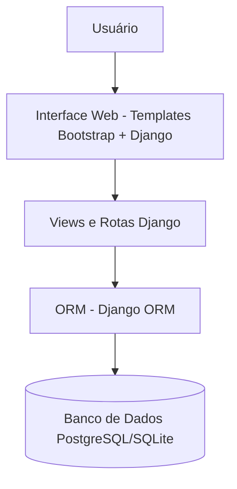

# 📘 Projeto Django - Sistema de Gestão Escolar

Este projeto é um **sistema de gerenciamento escolar** desenvolvido em **Django**, com foco em segurança, boas práticas de arquitetura e escalabilidade.  
O sistema permite gerenciar alunos, professores, agendamentos, relatórios e permissões de acesso de forma segura e organizada.

---

## 🚀 Como rodar o projeto

### Pré-requisitos
- Python 3.10+
- [Poetry](https://python-poetry.org/)

## Passos
### 1. Instalar o orquestrador
```bash
pip install poetry
```
### 2. Criar ambiente virtual para rodar dependências
```bash
poetry shell
```
### 3. Instalar dependências
```bash
poetry install
```
### 4. Rodar o projeto
```bash
task run
```
### 5. Rodar testes
```bash
pytest
```
# 📋 Planejamento e Requisitos
## ✅ Requisitos Funcionais

- Gerenciamento de alunos: cadastro, edição, listagem.

- Gerenciamento de agendamentos: adicionar, alterar, visualizar e excluir.

- Autenticação de usuários: login, logout e controle de permissões baseado em grupos (Diretoria, Coordenação, Professor).

- Geração de relatórios: atendimentos concluídos filtrados por data, com opção de download.

- Painel administrativo: controle de permissões e autorizações de usuários e grupos.

- CRUD completo: alunos, professores, usuários, agendamentos e tipos de conteúdo.

## 🔧 Requisitos Não Funcionais

- Uso do framework Django (padrão MVC).

- Interface responsiva com Bootstrap 5.

- Uso de Django ORM para abstração do banco de dados.

- Paginação e ordenação em listas de dados.

- Código modular e escalável (views, routers, forms, signals).

- Relatórios com filtros e download.

## 🔐 Medidas de Segurança

- Autenticação via sistema nativo do Django.

- Proteção CSRF em formulários.

- Controle de permissões por grupos e roles.

- ForeignKeys com on_delete=PROTECT.

- Validação e sanitização de dados via forms.

- Uso de signals para automação de permissões.

- Templates com escape automático de variáveis (proteção XSS).

- Logout destrói a sessão do usuário.

## ⚠️ Análise de Riscos

- Ameaça: SQL Injection<br/>
  ✅ Mitigada pelo uso de ORM e validação em forms.

- Ameaça: Cross-Site Request Forgery (CSRF)<br/>
   ✅ Prevenção com tokens CSRF nativos do Django.

- Ameaça: Cross-Site Scripting (XSS)<br/>
  ✅ Escape automático em templates.

- Ameaça: Exposição de dados sensíveis<br/>
  ✅ Uso de grupos e permissões bem definidos.

- Ameaça: Exclusão acidental de dados críticos<br/>
  ✅ Uso de on_delete=PROTECT em relações críticas.

🏛️ Modelagem de Arquitetura
📌 Diagrama de Arquitetura (alto nível)

---

## 🏛️ Modelagem de Arquitetura e Diagramas

### 📌 Diagrama de Arquitetura (alto nível)


## 📌 Modelagem de Dados

- Aluno: nome, matrícula, dados pessoais.

- Professor: nome, área de atuação.

- Agendamento: aluno, professor, conteúdo, horário, status.

- Relatório: registros de atendimentos concluídos.

- Usuário: login, senha (hash), grupo de permissões.

## 📌 Modelagem de Segurança

- Camada de autenticação e autorização (grupos: Diretoria, Coordenação, Professor).

- Middleware de proteção (CSRF, autenticação).

- Controle de acesso baseado em roles.

## 🛡️ Análise e Design de Segurança

- Modelagem de ameaças (Threat Modeling)

- Previsão contra SQL Injection, XSS e DoS.

- Uso de autenticação baseada em sessão.

- Arquitetura

- Separação de responsabilidades (MVC).

- Uso de signals para reforço de políticas de segurança.

- Controles de Segurança

- Criptografia de senhas (Django usa PBKDF2 por padrão).

- Autenticação obrigatória em views críticas.

- Segregação de funções via grupos de usuários.

## 🧪 Testes Implementados

### Os testes foram criados utilizando pytest e visam garantir:

- Autenticação e login/logout: previnem acessos não autorizados.

- Permissões de acesso: apenas usuários de determinados grupos podem realizar certas ações (ex.: apenas Coordenação pode alterar agendamentos).

- Validação de formulários: previne inserção de dados inválidos e ataques de injeção.

- Rotas protegidas: garantem que apenas usuários autenticados possam acessar recursos sensíveis.

- Esses testes reduzem a probabilidade de falhas críticas em produção e asseguram conformidade com as políticas de segurança definidas.

## 📜 Compliance
### Este projeto segue princípios de conformidade com:

- LGPD – proteção de dados pessoais de alunos e professores.

- Boas práticas de segurança da OWASP – prevenção contra vulnerabilidades comuns.

- Políticas internas de segregação de funções – controle de acessos baseado em grupos.


